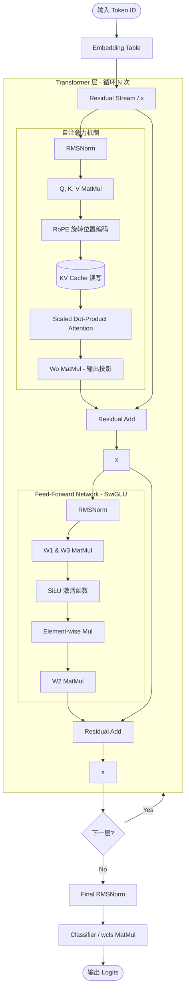

# Llama2.c 计算图详细讲解

本计划旨在详细解析 `llama2.c` 项目中 Transformer 模型的计算图结构与数据流向。通过 Mermaid 流程图和文字说明，帮助理解 Llama 2 架构在 C 语言中的具体实现。

## 1. 计算图概览

以下是 `llama2.c` 执行单次前向传播（`forward` 函数）时的计算逻辑流程：

---

## 2. 核心组件详解

### 2.1 输入阶段 (Input & Embedding)
- **Token Embedding**: 将离散的 Token ID 映射为稠密向量（维度为 `dim`）。
- **Residual Stream**: 初始化残差流 `x`。

### 2.2 Transformer Block (核心循环)
每一层（Block）包含两个主要的残差连接分支：

#### A. 自注意力分支 (Self-Attention)
1.  **RMSNorm (Pre-Norm)**: 使用均方根归一化。公式：$y = \frac{x}{RMS(x)} * w$。
2.  **QKV Projection**:
    - `q = matmul(x, wq)`
    - `k = matmul(x, wk)`
    - `v = matmul(x, wv)`
3.  **RoPE (Rotary Positional Embedding)**: 对 Q 和 K 应用旋转位置编码，将位置信息编码进向量的相位中。
4.  **KV Cache**: 将当前步的 K 和 V 存入 `key_cache` 和 `value_cache`，用于后续生成。
5.  **Attention Score**: 计算 $Softmax(\frac{QK^T}{\sqrt{head\_size}})V$。
6.  **Output Projection**: 通过 `wo` 映射回原始维度，并加回到残差流 `x`。

#### B. 前馈网络分支 (FFN - SwiGLU)
1.  **RMSNorm**: 第二次 Pre-Norm。
2.  **SwiGLU Activation**: Llama 2 采用的特殊结构。
    - 计算 `h1 = SiLU(matmul(x, w1))`
    - 计算 `h2 = matmul(x, w3)`
    - 融合：`hidden = h1 * h2` (逐元素乘)
3.  **Down Projection**: `out = matmul(hidden, w2)`。
4.  **Residual Add**: 将结果加回到残差流 `x`。

### 2.3 输出阶段 (Final Stage)
1.  **Final RMSNorm**: 对最后一层的输出进行归一化。
2.  **Classifier**: 使用 `wcls` (通常与 embedding 共享权重) 将向量映射回词表大小，输出每个 token 的概率得分（Logits）。

---

## 3. 关键数学算子实现 (run.c)

- **rmsnorm**: 计算平方和均值，求倒数，再缩放。
- **matmul**: 标准的矩阵-向量乘法，使用了 OpenMP (`#pragma omp parallel for`) 进行并行化加速。
- **softmax**: 带有数值稳定性处理（减去最大值）的指数归一化。
- **RoPE**: 涉及正余弦变换，对向量分两两一组进行旋转。

## 4. 开放性问题/建议
- **性能瓶颈**: `matmul` 是最耗时的部分。可以考虑引入硬件加速（如 SIMD 指令集或 Systolic Array）。
- **量化**: `runq.c` 实现了整型量化版本，可以对比其计算图差异。
